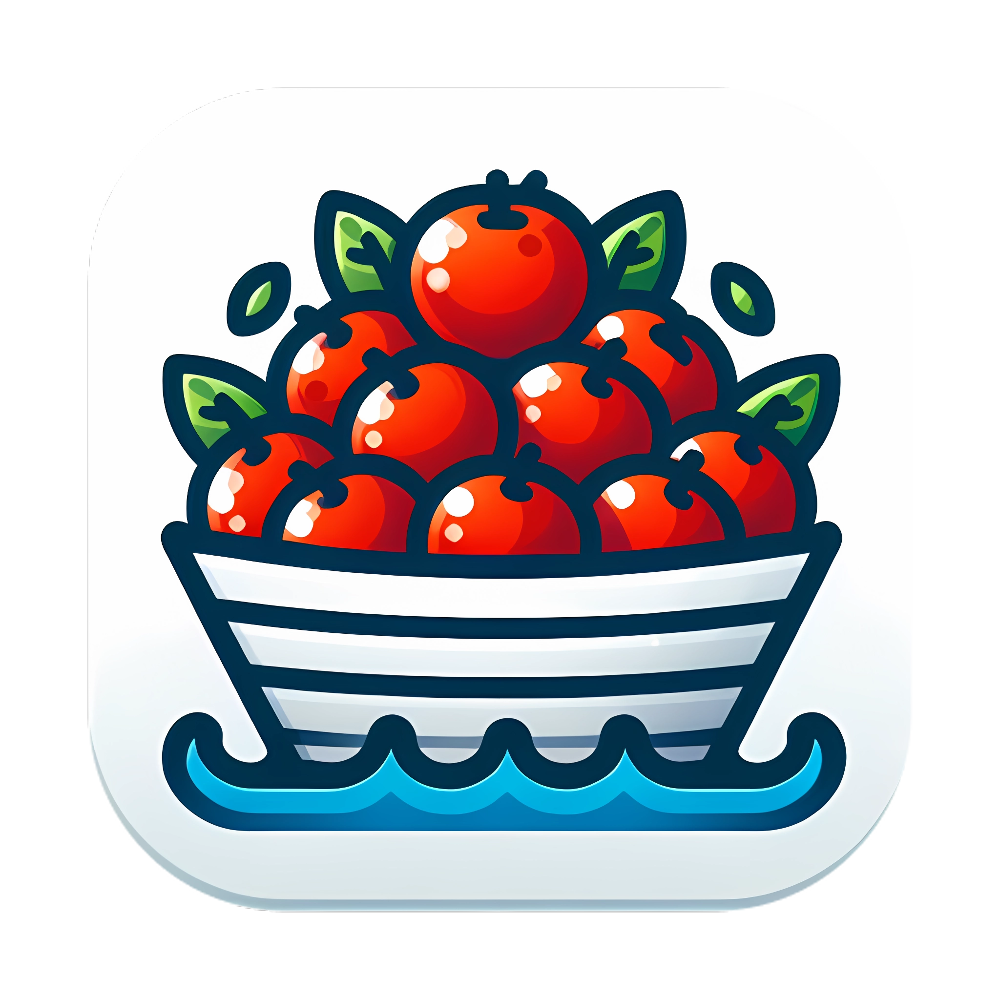

  <picture>
    
  </picture>

# Why another pomodoro timer?

Nothing special, just wanna learn Rust by writing an tauri app. At a moment, the idea just came up in my mind.

# What is the current state of the project?
Just a toy app. Use on your risk. There may be lots of modifications or re-writings in the future.

# How to develope?
Firstly, you need to have rust, cargo, node.js and Pnpm installed on your machine.

Run `cargo install tauri-cli` to install the command line toolkit of Tauri.

Run `pnpm install` under the root directory.

Run `cargo tauri dev` and start developing.

Run `cargo tauri build` when you want to build the app.
> For now, I only configure tauri to build for macOS platform, haven't built or tested on Windows and Linux.

# Problems that don't know how to solve
Yes, I want to implement a feature just like the awesome [SelfControl](https://github.com/SelfControlApp/selfcontrol) does. When a focus clock was started, the app can block the user from visiting websites in the black list.

But due to the file permission issue, still can't implement it.

